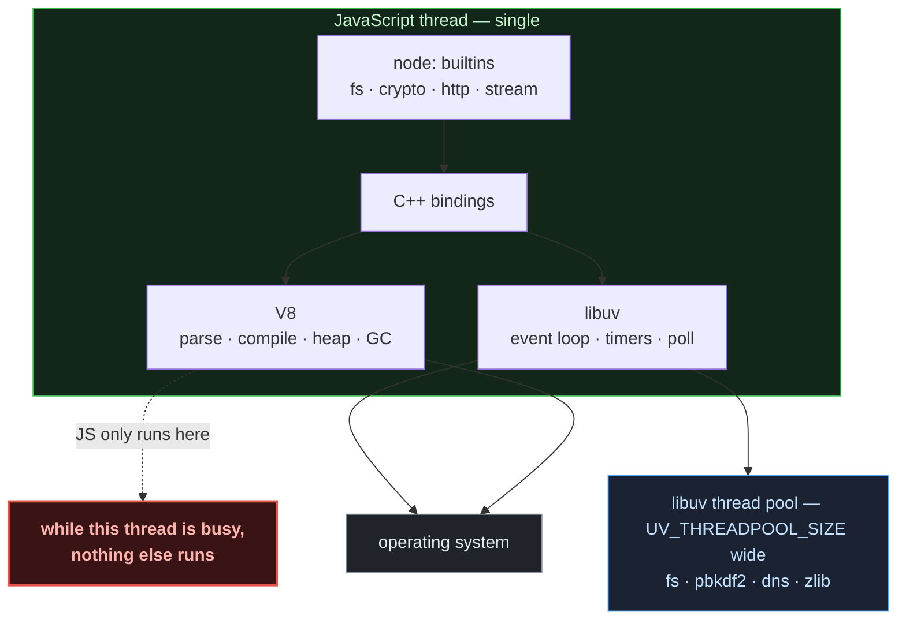
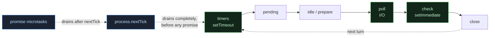
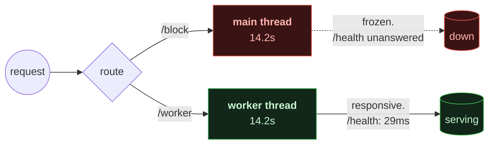
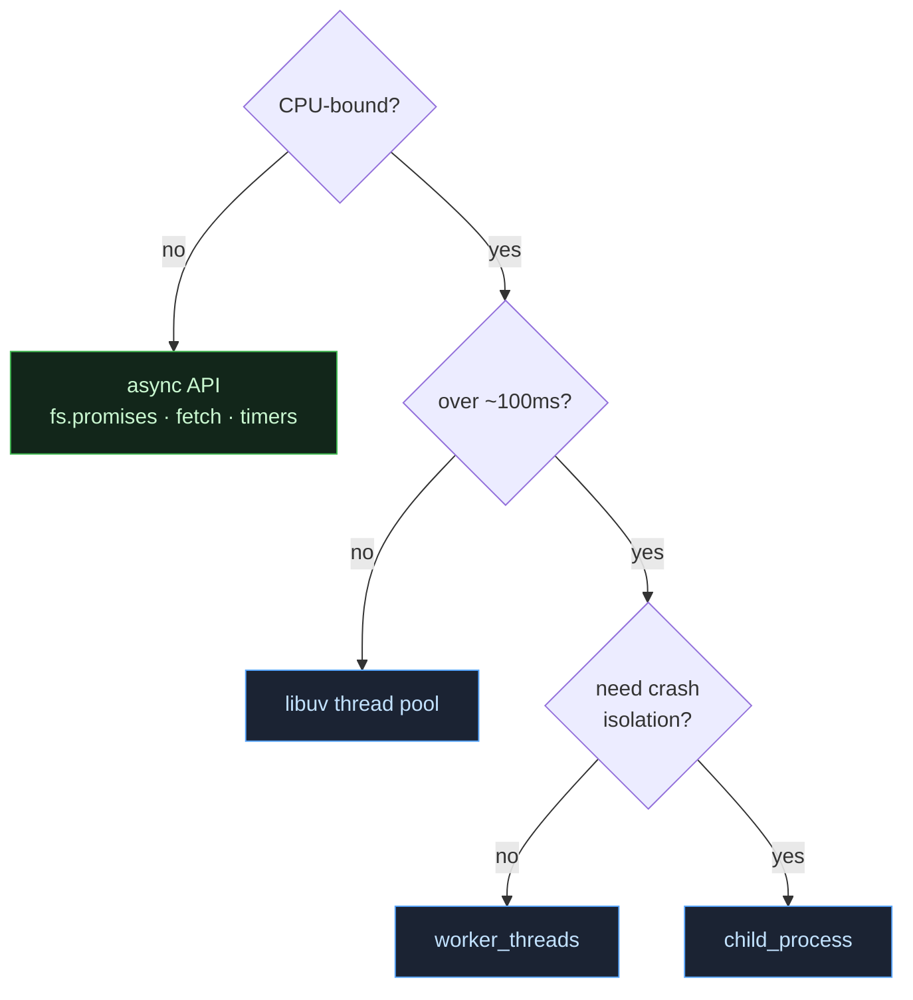
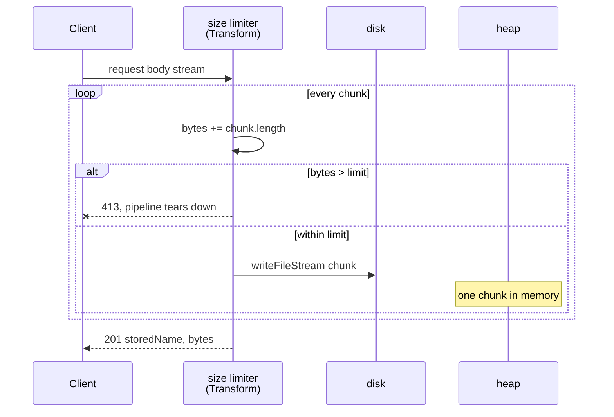

<div align="center">


# Node.js Mechanics &amp; Engines

**Runnable notes on how Node.js actually works.** Event loop, libuv, V8, thread
pool, worker threads, child processes.

[](https://nodejs.org)
[](nodejs-core)
[](nodejs-core)

Every demo uses **only `node:` builtins**. A library hides the exact mechanism
these exist to show.

</div>

---

## 📐 Architecture

Node is not V8. It is a JavaScript engine, an async I/O layer, and a process
manager sitting on top of the OS.



**The rule that explains most Node performance work:** your JavaScript is
single-threaded. Blocking work must move off — to the thread pool, a worker
thread, or a child process.

Deeper notes: [`3_node_advanced_topics/01_nodejs_internals.md`](3_node_advanced_topics/01_nodejs_internals.md)

---

## 🔄 Event Loop



So: **sync code → `nextTick` queue → promise microtasks → loop phases.**

```bash
npm run 01
```

```text
[1] sync: script starts
[6] sync: rest of the script
[2] process.nextTick            <-- queued 3rd, ran 1st
[3] second process.nextTick
[4] Promise.then                <-- queued 2nd, ran 4th
[5] Promise queued inside nextTick
[timer] top level setTimeout(0)
[immediate] top level setImmediate
```

The promise was queued **before** the `nextTick` and still lost. The `nextTick`
queue is drained completely before microtasks are touched at all.

---

## ⚙️ Blocking vs. Offloading

Same CPU-heavy loop, two routes.



Identical 14 seconds of work. The worker's own isolate lets the main event
loop keep accepting connections.

```bash
npm run 04
# GET /health · /block · /worker · /health
```

### Picking an escape hatch

| Tool | Use when | Isolation |
| --- | --- | --- |
| async API | I/O bound | — |
| thread pool | fs, dns, crypto, zlib | none, same process |
| worker thread | CPU-bound, stay in-process | own V8 isolate |
| child process | need crash isolation or a native addon | full process |



---

## 🧵 Thread Pool

A fixed pool of threads for the blocking C calls behind `fs`, `dns`, `zlib` and
`crypto`. **Default width is 4**, read from `UV_THREADPOOL_SIZE` exactly once,
when the pool is first created.

```bash
npm run 02:pool1   # serialised
npm run 02:pool4   # default
npm run 02:pool8
```

```text
thread pool size: 1
Scheduling 8 PBKDF2 tasks...
JS finished scheduling everything at 5 ms    <-- JS never waited
Task 3 finished at 180 ms
Task 8 finished at 377 ms                   <-- 8 tasks through 1 thread
```

Same work, roughly triple the wall clock. That gap is the pool width and nothing
else — which is why four slow requests can look like a single-threaded server.

Notes: [`3_node_advanced_topics/03_libuv.md`](3_node_advanced_topics/03_libuv.md)

---

## 🌐 HTTP & Streaming

Reading a request body is streaming, not buffering. One untrusted client can
otherwise exhaust the heap, so both demos cap their input.



```bash
npm run 06
curl -X POST --data-binary @clip.mp4 -H "X-File-Name: clip.mp4" \
     http://localhost:5004/upload
```

Peak memory is one chunk regardless of file size. Filenames come from the
browser, so they pass through `path.basename` and a containment check —
`../../../evil.png` collapses to a bare name and stays inside `uploads/`.

---

## 🚀 Running

```bash
npm install
```

| Script | Shows |
| --- | --- |
| `npm run 01` | loop ordering: `nextTick` vs promises vs timers |
| `npm run 02` | thread pool at the default width |
| `npm run 02:pool1` | same work, pool of 1 — watch the wall clock |
| `npm run 02:pool8` | same work, pool of 8 |
| `npm run 03` | event loop delay via `perf_hooks` |
| `npm run 04` | worker threads vs a blocked main thread (`:3070`) |
| `npm run 05` | `exec` — buffers output, waits to exit |
| `npm run 06` | `spawn` — streams stdout/stderr live |
| `npm run 07` | `fork` — Node child with an IPC channel |

Two TypeScript packages:

```bash
cd node.js_native_server/1_node_basics_and_nodejs_core_modules
npm install && npm run 01     # ... through npm run 11

cd ../2_node_http
npm install && npm run 01     # ... through npm run 06
```

| Core modules | | HTTP server | Port |
| --- | --- | --- | --- |
| `01` | `process` — argv, env, exit, signals | `01` bare `createServer` | 5000 |
| `02` | `crypto` — uuid, hash, HMAC + `timingSafeEqual` | `02` routing, status codes | 5001 |
| `03` | `os` — platform, cpus, memory | `03` request body, size cap | 5002 |
| `04` | `path` — traversal defence | `04` typed JSON helper | 5003 |
| `05` | `timers` — timeout, interval, immediate | `05` `fetch` + `AbortController` | — |
| `06` | callbacks vs promises vs async/await | `06` streaming upload | 5004 |
| `07` | `fs` — sync, callback, promise | | |
| `08` | `Buffer` — alloc, write, concat | | |
| `09` | `URL` / `URLSearchParams` | | |
| `10` | `EventEmitter` — on, once, emit | | |
| `11` | `stream` — Readable/Transform/Writable | | |

---

## 📂 Layout

```text
nodejs-core/
├── 01-event-loop-order/       execution-order.js
├── 02-libuv-thread-pool/      pbkdf2-pool.js
├── 03-perf-hooks/             event-delay.js
├── 04-worker-threads/         server.js · worker.js
├── 05-child-processes/        exec · spawn · fork
├── 3_node_advanced_topics/    internals · libuv · cluster notes
└── node.js_native_server/
    ├── 1_node_basics_and_nodejs_core_modules/   11 demos
    └── 2_node_http/                            6 demos
```

## 📖 Notes

- [Node.js internals](3_node_advanced_topics/01_nodejs_internals.md) — the four layers
- [libuv](3_node_advanced_topics/03_libuv.md) — event loop, timers, thread pool
- [cluster](3_node_advanced_topics/05_cluster_module.md) — when it is worth it
- [Concepts](node.js_native_server/1_node_basics_and_nodejs_core_modules/concepts.md) — project structure, learning order

## 💡 Takeaways

- `UV_THREADPOOL_SIZE` is read once, lazily — set it before the first `fs`/`crypto` call or you keep 4.
- `process.nextTick` drains before promise microtasks, even when queued later.
- A blocked main thread blocks timers, I/O callbacks and new requests alike.
- `exec` waits for output, `spawn` streams it, `fork` adds an IPC channel.
- Never buffer an unbounded request body.
- Compare secrets with `crypto.timingSafeEqual`, never `===`.

---

<div align="center">Built while learning Node.js internals.</div>